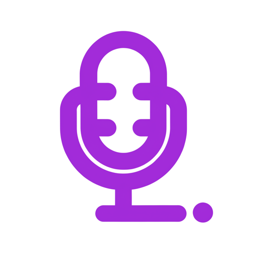
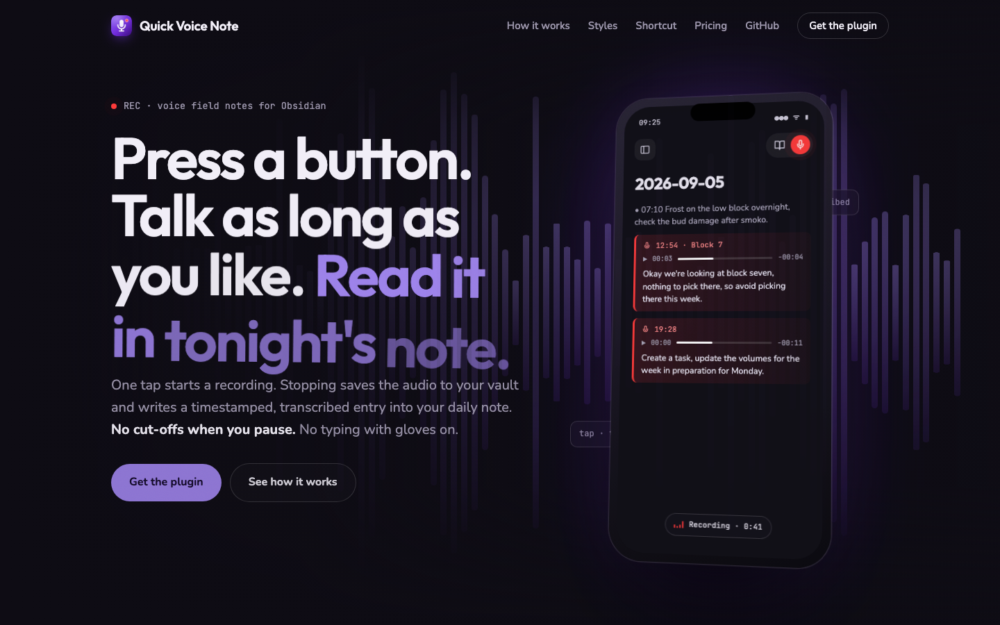

<p align="center">
  
</p>

<h1 align="center">Quick Voice Note</h1>

<p align="center"><strong>Press a button. Talk as long as you like. Read it in today's note.</strong></p>

<p align="center"><a href="https://quickvoicenote.com"></a></p>
<p align="center"><a href="https://quickvoicenote.com">quickvoicenote.com</a></p>

Long-form voice memos for Obsidian. One tap starts a recording; stopping saves the
audio to your vault and appends a timestamped, transcribed entry to today's
daily note:

```markdown
- 14:32 ![[Recordings/Voice 2026-09-05 14-32-10.m4a]]
    - lecture recap: three causes of the crisis, the second one is the essay question
```

Built for people who think out loud — students recapping a lecture on the
walk home, founders with a business idea in the car, anyone whose best
thoughts arrive away from a desk. Unlike system dictation, it doesn't cut off when you pause, keeps
the original audio as backup, and files everything exactly where you'll look
for it tonight.

## How it works

- **Mobile:** a red mic sits in the note header next to the reading-mode
  toggle — tap it and you're already recording.
- **Desktop:** mic button in the ribbon, or the "Record voice note" command.
- **One-tap from your pocket:** point an iOS Shortcut, Android shortcut, or an
  NFC tag at `obsidian://voice-note` — Obsidian opens with recording already
  running. One tap stops and saves.
- Stopping saves the audio into your vault (`Recordings/` by default),
  transcribes it, and adds the entry to today's daily note — respecting
  your Daily Notes folder, format, and template — or to the note you're in.

## Where it lands, and how it looks

Under **Settings → In the note**:

- **Save to:** today's daily note, the note you're in (at the cursor or at
  the end), or ask after each recording.
- **Audio in the note:** embedded player, a link to the file, or transcript
  only. The recording is always kept in the recordings folder.
- **Memo style:** list item, voice callout (a tinted card with a mic icon —
  pick the colour and wash strength), quote block, heading per memo, plain
  paragraph, or a single line. A live preview shows each one, and the
  template under Advanced is yours to edit for anything else.

## Transcription

Recordings become readable text via any OpenAI-compatible transcription API.
Bring your own key (OpenAI, Groq, or a local Whisper server) under
**Settings → Advanced → Transcription service**.

Prefer zero setup? A **Cloud key** (A$9/month, 3-day free trial) gives you
managed transcription with no accounts, no API keys and no configuration:
[start a trial](https://quickvoicenote.com/#pricing), then paste the license
key into **Settings → License key**.

Transcription is optional: without it you still get one-tap audio capture
filed into your daily notes.

## Install

Settings → Community plugins → Browse → search **Quick Voice Note**, or
[install directly from Obsidian](obsidian://show-plugin?id=quick-voice-note). Manual install: copy `main.js`, `manifest.json`,
and `styles.css` from the [latest release](https://github.com/spencer1975/quick-voice-note/releases/latest)
into `<your vault>/.obsidian/plugins/quick-voice-note/`, then enable the plugin.

## Privacy

- Audio stays in your vault. It leaves your device only if transcription is
  enabled, and then only to the endpoint you configure.
- Your API key is stored in the plugin's local data file inside your vault and
  is never transmitted anywhere except the transcription endpoint you chose.

## Settings

The defaults are deliberately boring — most people only ever touch the
transcription key. Everything else (templates, folders, headings, file
naming, daily-note fallbacks) lives under **Advanced**.
